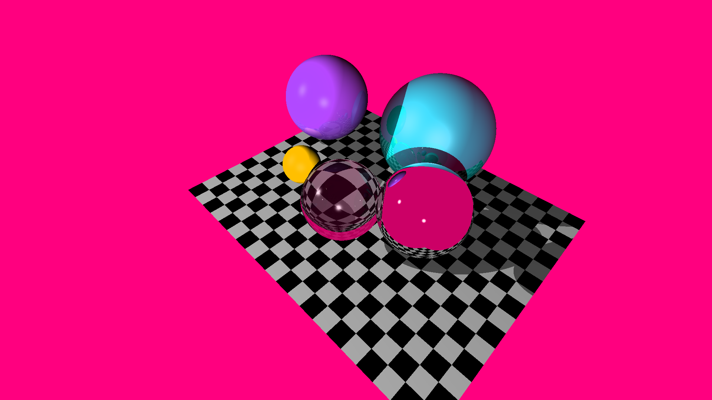

# tinyraytracer-Rust

It is inspired from [tinyraytracer](https://github.com/ssloy/tinyraytracer) by [ssloy](https://github.com/ssloy) which is written in C++. This is a Rust version of it. It is a very good tutorial for beginners to learn ray tracing. I have tried to keep the code as close to the original as possible.



## Requirements

- git
- rustc (> 1.50)
- cargo (> 1.50)

## How to compile and run

If you have `cargo` installed, you can compile and run it using:

```bash
git clone https://github.com/Qazalbash/tinyraytracer-Rust.git
cd tinyraytracer-Rust
cargo run --release
```

Otherwise, you can compile it manually using `rustc` and run the executable `tinyraytracer`:

```bash
git clone https://github.com/Qazalbash/tinyraytracer-Rust.git
cd tinyraytracer-Rust
rustc -C opt-level=3 -C target-cpu=native -C lto -C codegen-units=1 -C panic=abort -C debuginfo=0 -C metadata=8e0d7b5e2e2b3b3e --out-dir ./target --crate-name tinyraytracer src/main.rs
```

## Future work and improvements

There are many things that can be improved in this code. The first and foremost thing is to make it more optimized. I have tried to make it as optimized as possible, but there is still a lot of room for improvement. One aspect is to less use static variables and use dynamic memory allocation instead. I am also planning to make this in OpenCL and CUDA.

## Related projects

- [tinyraytracer-C](https://github.com/Qazalbash/tinyraytracer-C)

## Contributors

<a href="https://github.com/Qazalbash/tinyraytracer-Rust/graphs/contributors">
  
</a>

Made with [contrib.rocks](https://contrib.rocks).
